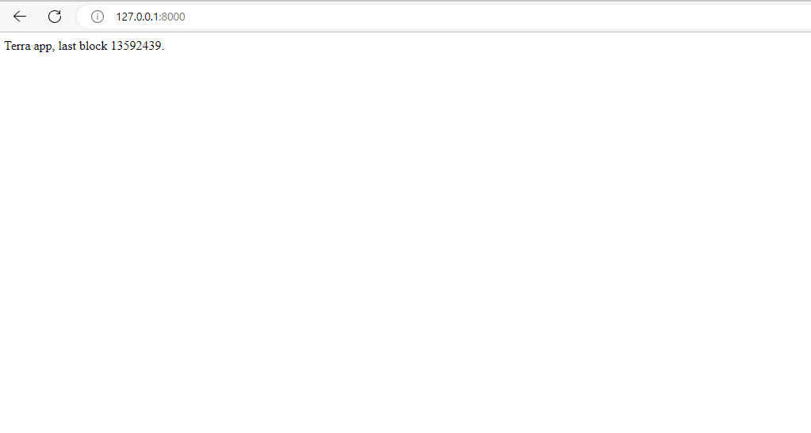

```
pip install django
```
```
pip install terra-classic-sdk
```
```
django-admin startproject django_app
```
```
python manage.py startapp terra_app
```

terra_app/views.py
```python3
from django.http import HttpResponse
from terra_classic_sdk.client.lcd import LCDClient

TERRA = LCDClient(chain_id="columbus-5",url="https://terra-classic-lcd.publicnode.com")

def index(request):
    return HttpResponse("Terra app, last block {} on Terra Classic blockchain.".format(TERRA.tendermint.block_info()['block']['header']['height']))
```
django_app/urls.py
```python
from django.contrib import admin
from django.urls import path
from terra_app import views

urlpatterns = [
    path('admin/', admin.site.urls),
    path('', views.index, name="index"),
]
```
```
python manage.py runserver
```
